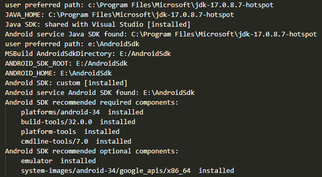
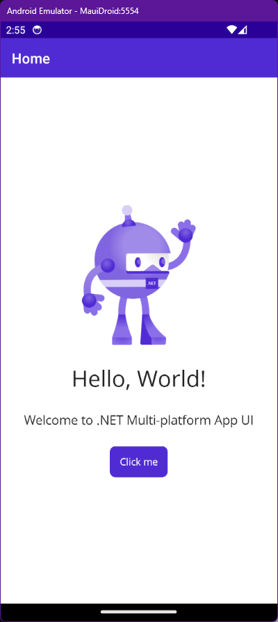

The past few months I've been thinking about how parts of a Blazor project [such as ViewModels]() could be shared with a mobile app written in .NET MAUI, and now that I've got some time to sit down with it I thought I'd share what I've learned, especially given the lack of good guides (from my searches, exactly none) on using VS Code to get there effectively. I get bonus points for doing this on Linux, but the jist should be the same (or easier) for other platforms.

This first part will cover setting up to deploy an Android MAUI app to either an emulator or a real life Android device, the next part will explore opportunities for crossover between MAUI and Blazor apps.

<!--more-->

The instructions for this guide have been distilled and adapted from [this official Microsoft documentation](https://learn.microsoft.com/en-us/dotnet/maui/get-started/installation?tabs=visual-studio-code).

This guide assumes you have Visual Studio Code installed. You will also need:

- [.NET 8.0 SDK](https://dotnet.microsoft.com/en-us/download/dotnet/8.0) (this is in pre-release at time of writing, I am using RC2)
- [.NET MAUI Extension](https://marketplace.visualstudio.com/items?itemName=ms-dotnettools.dotnet-maui) for VS Code

## Create and Run a .NET MAUI Android Project

1. Open a terminal and run the following command to install the MAUI Android SDK:
    ``` sh
    dotnet workload install maui-android
    ```
    - You can substitute `maui-android` for `maui` to install SDKs for all target devices. Run `dotnet workload search maui` to see what else is available.

2. [Install OpenJDK **17**](https://learn.microsoft.com/en-us/java/openjdk/download#openjdk-17) - note that builds will fail if OpenJDK 11 is used instead, despite what the Microsoft documentation says here.
    - If you use Chocolatey on Windows, you can install `microsoft-openjdk17`
    - On Fedora, install `java-17-openjdk`

3. Create a new .NET MAUI project from VS Code; open the command palette (Ctrl+Shift+P) and select _.NET: New Project..._
    
    - Select _.NET MAUI App_, give it a name and choose its location.

4. Open the generated `.csproj` file and make the following changes:

    - Remove unused target frameworks from `<TargetFrameworks>` near the top:
      ``` xml
      <TargetFrameworks>net8.0-android</TargetFrameworks>
      ```
    - Remove `<SupportedOSPlatformVersion>` tags that are not applicable to this project, in my case I'm keeping the one with Android in it.

5. Install Android dependencies by building the new project with the following command:

    ``` sh
    dotnet build -t:InstallAndroidDependencies -f:net8.0-android -p:AndroidSdkDirectory="<android-sdk-directory>" -p:AcceptAndroidSDKLicenses=True
    ```
    - For Windows, the suggested Android SDK Directory is `$env:LOCALAPPDATA/Android/Sdk`
    - For Linux, you could use `~/.local/share/Android/Sdk`

6. Open the VS Code command palette and run _.NET MAUI: Configure Android_, choosing _Refresh Android environment_, it will notify you of any missing components.

    - Ensure the Android SDK and Java SDK (OpenJDK) paths are correctly set; if not, they can be set under the _.NET MAUI: Configure Android_ command
    - In my case I was missing the Android 34 platform, the Android 34 image and cmdline-tools.

        1. Open Android Studio from the install directory specified before
        2. From the main screen, click the _More Actions_ menu and select SDK Manager
        3. Under the _SDK Platforms_ tab check the _Show Package Details_ option at the bottom of the screen
        4. Expand _Android API 34_ in the list and select the following:
            - Android SDK Platform 34
            - Sources for Android 34
            - Google APIs Intel x86_64 Atom System Image
        5. Go to the _SDK Tools_ tab and check the _Show Package Details_ option again
        6. Find the heading for _Android SDK Command-line Tools (latest)_ and choose version _7.0_
        7. Find _Android Emulator_ in the list and make sure it's checked
        8. Click the _Apply_ button to install everything now

    - Run it again and make sure it's all tickety-boo:
    

7. Back in VS Code, open a `.cs` or `.xaml` file within the project and click the `{ }` button at the bottom-right of the window.
    - Click on _Debug Target_ to choose the destination, either emulator or a physical device if it's plugged in

8. Press _F5_ on your keyboard and watch the app run! Not only that but you should be able to put in breakpoints (e.g. the `OnCounterClicked()` method in `MainPage.xaml.cs`) and pause execution as you'd expect.



## Notes
- The `launch.json` profile that is created has a reference to a `maui: build` task which is _not_ automatically created and this is by design. It's not needed, despite a warning I saw that the task couldn't be found. I'll be honest I'm not sure what fixed it, possibly the installation of the MAUI extension or fulfilling all the other steps.