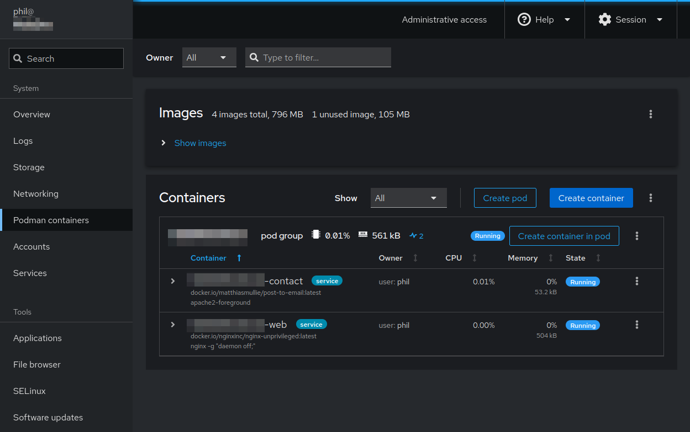

I was looking into alternatives to Docker Compose for Podman (yes, there is a [podman-compose](https://docs.podman.io/en/latest/markdown/podman-compose.1.html) wrapper that brings similar functionality to Podman), and stumbled across the concept of [Quadlets](https://docs.podman.io/en/latest/markdown/podman-systemd.unit.5.html). Well, turns out they're nothing like Docker Compose, perhaps more like Kubernetes or one of them fellas. Indeed, the name Quadlet was supposedly named after a squashed Kubelet. Geddit? Squashed kube? A quad? Ah, never mind.
<!--more-->

## What is it?
Here's what the Podman documentation has to say about Quadlets:

> Podman supports building and starting containers (and creating volumes) via systemd by using a systemd generator.

If you've ever run the `systemctl` command on Linux, you've directly used systemd. At a high-level, systemd manages and configures services in a Linux system. Podman integrates with this system allowing us to define and run containers as services, even in rootless mode. The definition files you provide are transformed into `.service` files through the aforementioned Podman generator, which seems to be available with your standard Podman installation.

## Need to know
### File suffixes
The following file suffixes are available for defining Quadlets; with a rudimentary understanding of Docker/Podman you should be able to guess what most of them do:

- .container
- .volume
- .network
- .kube
- .image
- .build
- .pod

### Rootless containers as a service
Podman makes a big deal of running containers in a rootless manner. If you're running containers from the context of your own user, you'll need to ensure your services can start automatically on reboot by enabling lingering for your user:

``` bash
sudo loginctl enable-linger myusername
```

Also be aware that as a rootless user you will not be allowed to map to ports with numbers lower than 1024 (e.g. 80, 443) without a workaround.

### Quadlet file paths
#### Rootful
If you must run the containers as root, here are the [rootful unit search paths](https://docs.podman.io/en/latest/markdown/podman-systemd.unit.5.html#podman-rootful-unit-search-path):
- `/etc/containers/systemd/` - system administrator defined quadlets (that's you)
- `/run/containers/systemd/` - intended for temporary quadlets, e.g. for testing
- `/usr/share/containers/systemd/` - distribution defined quadlets

#### Rootless
Podman works well as rootless so it makes sense to give this one serious consideration. Here are the [rootless unit search paths](https://docs.podman.io/en/latest/markdown/podman-systemd.unit.5.html#podman-rootless-unit-search-path):
- `$XDG_RUNTIME_DIR/containers/systemd/`
- `$XDG_CONFIG_HOME/containers/systemd/` or `~/.config/containers/systemd/`
- `/etc/containers/systemd/users/$(UID)`
- `/etc/containers/systemd/users/`

## Simple Example
This simple example declares a single container and a single pod. It will deploy an Nginx container, but to make it interesting I will be using the [nginx-unprivileged](https://hub.docker.com/r/nginxinc/nginx-unprivileged) container to avoid any need for rootfulness. Definition files will be created in a project directory and then symlinked to the `~/.config/containers/systemd/` directory.

### myproject.pod
Let's say this file is at `~/dev/myproject/myproject.pod`

``` ini
[Unit] # Standard systemd unit definition configuration
Description=MyProject Pod # Shows up in tools that list services and the like

[Install] # Standard systemd installation configuration
WantedBy=default.target # Ensures the pod is installed and ready to go at boot time

[Service] # Standard systemd service configuration
Restart=always # Ensure the service recovers if it errors out, as well as on reboots

[Pod] # Pod specific information
PodName=myproject # Give the pod a name
PublishPort=8000:8080 # Expose port 8080 (HTTP) on the container as port 8000 on the host
PublishPort=8001:4443 # Expose port 4443 (HTTPS) on the container as port 8001 on the host
```

Note that ports are exposed through the pod, not the container! Running a container rootless means that "lower" ports (those numbered less than 1024) are not allowed to be bound. It is possible to work around this by redirecting the port through the firewall, or setting up a rootful reverse proxy to handle port forwarding correctly. Just don't forget to set the `listen` ports in your Nginx configuration to match what you have here.

Multiple ports can be defined by adding multiple `PublishPort` entries.

For more information on other Pod settings, check the documentation [here](https://docs.podman.io/en/latest/markdown/podman-systemd.unit.5.html#pod-units-pod).

### myproject-web.container
And this file is at `~/dev/myproject/myproject-web.container`

``` ini
[Unit] # Standard systemd unit definition configuration
Description=MyProject Nginx Server # Shows up in tools that list services and the like

[Container]
ContainerName=myproject-web # Give the container a name
Image=docker.io/nginx # The image to use for the container - don't use the short name!
Volume=/home/myusername/dev/myproject/nginx.conf:/etc/nginx/nginx.conf:z,ro # Volume map a single file
Volume=/home/myusername/dev/myproject/html:/usr/share/nginx/html:z,ro # Volume map a directory
Pod=myproject.pod # The filename of the pod defined previously
```

Again, note that the ports are exposed in the pod, not the container. Also note that the `Volume` key is defined twice to map two different volumes.

The volume definitions are suffixed with `:z,ro`. if you're not using SELinux, you can leave it as simply `:ro` (readonly).

For more information on other Container settings, check the documentation [here](https://docs.podman.io/en/latest/markdown/podman-systemd.unit.5.html#container-units-container).

### SELinux
If your system is using SELinux, you'll need to allow containers permission to access the directory. I'm going to blanket enable it for all directories starting from `~/dev/myproject`:

``` bash
sudo semanage fcontext -a -f a -t container_file_t -r 's0' '/home/myusername/dev/myproject(/.*)?'
sudo restorecon -Rv /home/myusername/dev/myproject/
```

### Symlink and create the services
These definitions don't exist in the locations systemd [will look for them](#quadlet-file-paths), so we'll symlink them into the `~/.config/containers/systemd/` directory now.

``` bash
mkdir -p ~/.config/containers/systemd
ln -s ~/dev/myproject/myproject.pod ~/.config/containers/systemd/myproject.pod
ln -s ~/dev/myproject/myproject-web.container ~/.config/containers/systemd/myproject-web.container
```

And tell the user-context systemd to refresh itself so that it will create services based on those definitions. It is necessary to run this command every time the definitions files change.

``` bash
systemctl --user daemon-reload
```

Now start the pod and check if the pod service is running:

``` bash
systemctl --user start myproject-pod
systemctl --user status myproject-pod
```

If there is an error on starting, check out the `journalctl` command hinted in the error:

``` bash
journalctl --user -xeu myproject-pod.service
```

See the running containers:

``` bash
podman ps
```

Or be a cool guy like me and use [Cockpit](https://cockpit-project.org/) instead.



## Tips
### Reload Nginx configuration after changes
``` bash
podman exec -it myproject-web nginx -s reload
```

## Conclusion
That should be it! I've covered the basics here, it shouldn't be too hard to build upon that. Just keep adding those `.pod` and `.container` files, or `.volume` if you need it.

It does occur to me that this is a very particular method of deploying pods, given its reliance on systemd. This may be fine for smaller projects or projects where it's known that this will be the target system, but I wonder if it may be more helpful to lean on Kubernetes or something similar to allow for more flexibility. I will continue to use it as it personally suits my use case nicely.