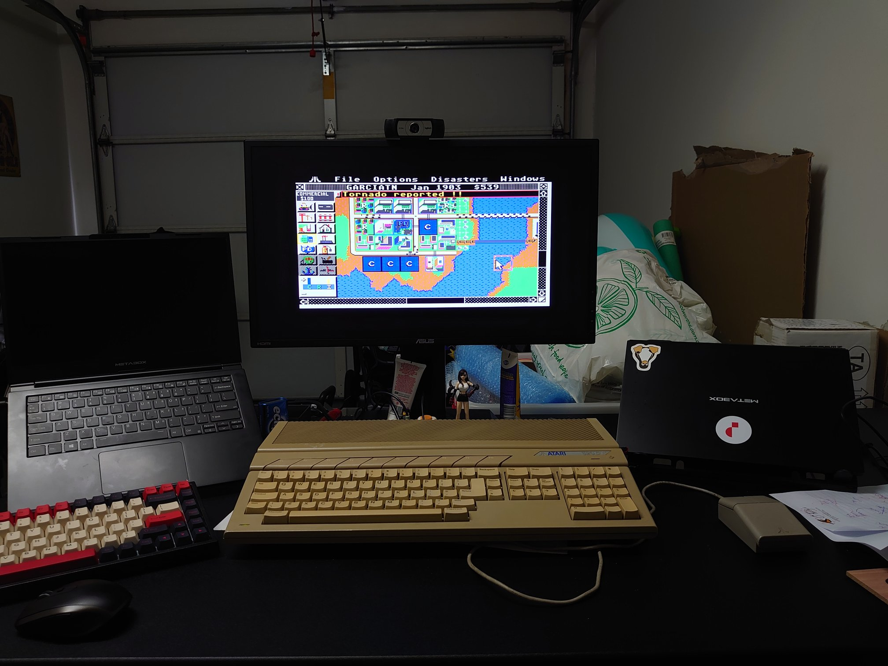

It's been a whole number of years since I owned an Atari ST. Well over 20. In my youth I (and by _"I"_ I mean _"my family"_) had two, both of which packed in after some time, the last kicking the bucket in the mid to late 90s. Ever since then I've longed to have another, even as I moved briefly to the Amiga before joining the PC train in 1999. Every now and then I'd look on eBay or Gumtree to see what was available. For some reason I was reluctant to splash out on one, until now.

A recent visit to Gumtree revealed a working STE with 2MB RAM and some minor cosmetic issues not far from where I live. The price was right too, and with a spacious garage to tinker with it I could no longer resist. I went out to meet the owner and relieved him of it. It was a pleasant encounter too, to call the man an enthusiast would not do him any credit. He had at least another 7 STs in his garage, as well as an incredibly rare Falcon 030.

Well I took my new old ST home and despite being warned about modern monitor compatibility with the generously included adapter, I was stoked to find my monitor (a 24\" [Asus VG245](https://www.asus.com/us/displays-desktops/monitors/gaming/vg245h/) from around 2017) worked almost without a hitch. Low and medium resolutions work perfectly although regretably there is no way that I can find to maintain the original aspect ratio. High resolution works fine too, although it took some minor monitor positionining adjustments to look right.

Of course having gone without an ST for so long I didn't have any disks save the ones provided by the seller, most of which I can't say I have any interest in, even though he did generously throw in an old ST Format disk with music making software [Quartet](http://www.stformat.com/stf58/index.html#cdsk) on it. So the next thing I went on the hunt for was a [Gotek floppy emulator](http://www.gotekemulator.com/). This device allows an ST to read disk images from a USB drive, opening up a whole swathe of possibilities. Again I found a seller local to me and arranged a same-day pickup. Within a couple of hours of ordering I was back in [NEOchrome](https://en.wikipedia.org/wiki/NEOchrome).

So now the question is, what am I going to do with this machine? It doesn't really fit into modern day computing with its underpowered multimedia capabilities and no straight-forward internet capability. The first thing is to revisit my aforementioned youth. I spent a lot of time on this machine and still have very fond memories of using it. I want to rediscover what made it so fun, and see if it can inspire me to use my more modern machines in a more fulfilling manner. Maybe I will try my hand at building an app or two with C.

A friend shared an article about [The Computer Built To Last 50 Years](https://ploum.net/the-computer-built-to-last-50-years/). This has also inspired me to find a real use for it. This machine was probably assembled in the late 80s which puts it at over 30 years old already, I'm sure it can last another 20, especially with the electronics know-how I've gained in the intervening years and probably local support from the group of retro computing enthusiasts that I've now inadvertently found myself amongst.

Whatever it is I do, I'm sure it will be fun figuring it out, and while I'm kicking myself for not doing it far sooner, I'm enjoying every minute that the machine is hooked up to the monitor and turned on.
