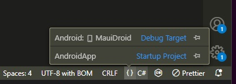

I took some time to investigate developing a MAUI mobile app that shares business logic with a Blazor web app by way of ViewModels and the like. What I discovered was that MAUI and XAML is a pretty cumbersome framework. My colleague Kael [gave me some insight](https://www.kaels-kabbage.com/posts/cross-platform-options-a-very-shallow-exploration/#maui-blazor-hybrid) on the possibility of building a Blazor app and running that as a MAUI app. After looking into it in more detail I came to the conclusion that having a single application with multiple deployment targets is a more practical approach to cross-platform development. This article serves as a guide to developing a single application that can be deployed as both a website and an Android app. Of course there are a few platform specific things to look out for but they're easily handled as I will demonstrate in this post.

<!--more-->

But first, why exactly would you want to go down this route? In my mind, apps should be developed specifically for the platform they're targeting. I figure this way they'll be performant and consistently adhere to the platform's own design. The reality seems to be that app designs are so wildly inconsistent anyway that there isn't much value in this way of thinking. As for performance, although I haven't measured it I reckon the difference for your run of the mill line of business app would be largely negligible. As the [ASP.NET Blazor Hybrid documentation](https://learn.microsoft.com/en-us/aspnet/core/blazor/hybrid/?view=aspnetcore-8.0) states:

> In a Blazor Hybrid app, Razor components run natively on the device. Components render to an embedded Web View control through a local interop channel. Components don't run in the browser, and WebAssembly isn't involved. Razor components load and execute code quickly, and components have full access to the native capabilities of the device through the .NET platform.

Of course the real bonus of doing this approach is that there is only one UI to maintain. Perhaps you'd want to go full MAUI if the mobile app designs are significantly different from the web app design, but from my experience they generally follow almost identical patterns.

This guide pulls information from the ASP.NET Blazor Hybrid documentation, the following pages are especially helpful:

- [ASP.NET Core Blazor Hybrid](https://learn.microsoft.com/en-us/aspnet/core/blazor/hybrid/?view=aspnetcore-8.0)
- [Reuse Razor Components in ASP.NET Blazor Hybrid](https://learn.microsoft.com/en-us/aspnet/core/blazor/hybrid/reuse-razor-components?view=aspnetcore-8.0)

This guide assumes you have [Visual Studio Code](https://code.visualstudio.com/) installed. You will also need:

- [.NET 8.0 SDK](https://dotnet.microsoft.com/en-us/download/dotnet/8.0) (this is in pre-release at time of writing, I am using RC2)
- [.NET MAUI Extension](https://marketplace.visualstudio.com/items?itemName=ms-dotnettools.dotnet-maui) for VS Code
- [OpenJDK **17**](https://learn.microsoft.com/en-us/java/openjdk/download#openjdk-17) - note that builds will fail if OpenJDK 11 is used instead, despite what the Microsoft documentation says here
    - If you use Chocolatey on Windows, you can install **microsoft-openjdk17**
    - On Fedora, install **java-17-openjdk**
- [Android Studio](https://developer.android.com/studio) which can be easily installed with a command as explained later in this guide

## Create Razor Class Library

The Razor Class Library contains the majority of the application and is referenced from the MAUI Android and Blazor web projects.

1. Open a terminal and navigate to the directory that will serve as the root of the solution. Run the following to create a Razor Class Library project, substituting the name if necessary:
    ``` sh
    dotnet new razorclasslib -n AppComponents
    ```

2. Delete some things:
    - Delete the **wwwroot** directory
    - Delete **Component1.razor** and **Component1.razor.css**
    - Delete **ExampleJsInterop.cs**

## Create MAUI Android Project

This project is deployable to Android devices; essentially a MAUI app hosting Blazor components.

1. Using the terminal, run the following command to install the MAUI Android SDK:
    ``` sh
    dotnet workload install maui-android
    ```
    - You can substitute `maui-android` for `maui` to install SDKs for all target devices. Run `dotnet workload search maui` to see what else is available.

2. Go to the root of the solution and run the following to create a MAUI Blazor Hybrid app:
    ``` sh
    dotnet new maui-blazor -n AndroidApp
    ```

4. Open the **AndroidApp.csproj** file and make the following alterations:
    - Remove target frameworks that you don't need from the `<TargetFrameworks>` tag
    - Look for the tags `<SupportedOSPlatformVersion>` and `<TargetPlatformMinVersion>` and again remove the entries that do not apply to your app

5. Delete some things:
    - Open the **Platforms** directory and remove platforms you don't intend to target
    - Remove the **Components** directory

6. Install Android dependencies (i.e. Android Studio and associated tools) by building the new project with the following command:

    ``` sh
    dotnet build -t:InstallAndroidDependencies -f:net8.0-android -p:AndroidSdkDirectory="<android-sdk-directory>" -p:AcceptAndroidSDKLicenses=True
    ```
    - For Windows, the suggested Android SDK Directory is `$env:LOCALAPPDATA/Android/Sdk`
    - For Linux, you could use `~/.local/share/Android/Sdk`

7. Open the VS Code command palette and run _.NET MAUI: Configure Android_, choosing _Refresh Android environment_, it will notify you of any missing components.

    - Ensure the Android SDK and Java SDK (OpenJDK) paths are correctly set; if not, they can be set under the _.NET MAUI: Configure Android_ command
    - In my case I was missing the Android 34 platform, the Android 34 image and cmdline-tools.

        1. Open Android Studio from the install directory specified before
        2. From the main screen, click the _More Actions_ menu and select SDK Manager
        3. Under the _SDK Platforms_ tab check the _Show Package Details_ option at the bottom of the screen
        4. Expand _Android API 34_ in the list and select the following:
            - Android SDK Platform 34
            - Sources for Android 34
            - Google APIs Intel x86_64 Atom System Image
        5. Go to the _SDK Tools_ tab and check the _Show Package Details_ option again
        6. Find the heading for _Android SDK Command-line Tools (latest)_ and choose version _7.0_
        7. Find _Android Emulator_ in the list and make sure it's checked
        8. Click the _Apply_ button to install everything now

    - Run it again and make sure it's all tickety-boo, it should look something like a-this:
        ```
        user preferred path: c:\Program Files\Microsoft\jdk-17.0.8.7-hotspot
        JAVA_HOME: C:\Program Files\Microsoft\jdk-17.0.8.7-hotspot
        Java SDK: shared with Visual Studio [installed]
        Android service Java SDK found: C:\Program Files\Microsoft\jdk-17.0.8.7-hotspot
        user preferred path: e:\AndroidSdk
        MSBuild AndroidSdkDirectory: E:\AndroidSdk
        ANDROID_SDK_ROOT: E:/AndroidSdk
        ANDROID_HOME: E:\AndroidSdk
        Android SDK: custom [installed]
        Android service Android SDK found: E:\AndroidSdk
        Android SDK recommended required components:
            platforms/android-34  installed
            build-tools/32.0.0  installed
            platform-tools  installed
            cmdline-tools/7.0  installed
        Android SDK recommended optional components:
            emulator  installed
            system-images/android-34/google_apis/x86_64  installed
        ```

## Create Blazor Web Project

This project is a Blazor WASM app that runs in a web browser.

1. Using the terminal, go to the root of the solution and run the following to create a Blazor Web app:
    ``` sh
    dotnet new blazorwasm -n WebApp
    ```

2. Uh... there is no step 2

## Setup Project References

1. Use the terminal to add the projects to the solution by entering the following from the solution's root directory:
    ``` sh
    dotnet sln add AppComponents
    dotnet sln add AndroidApp
    dotnet sln add WebApp
    ```
    
2. Add references to the AppComponents project to the other two projects:
    ``` sh
    dotnet add AndroidApp reference AppComponents
    dotnet add WebApp reference AppComponents
    ```

## Migrate Blazor Components

1. Move the directory **Components** from the **WebApp** Blazor project and put it into the root of the **AppComponents** project.

2. Open the file **_Imports.razor** under **AppComponents/Components**

3. Remove the following line:
    ``` csharp
    @using Microsoft.AspNetCore.Components.WebAssembly.Http
    ```

4. Change the instances of `WebApp` to `AppComponents` (VS Code protip: click on one of them and press `Ctrl+Shift+L` to change them all at once) and save your changes

5. Open the file **Program.cs** in **WebApp** project

6. Alter the `using` statement that references `WebApp.Components` to be `AppComponents.Components`

7. Open the file **_Imports.razor** under **AndroidApp**

8. Alter the `@using` statement that references `AndroidApp.Components` to be `AppComponents.Components`

9. Open the file **MainPage.xaml** under **AndroidApp**

10. Change the line with `xmlns:local` to point to the AppComponents project instead:
    ``` xml
    xmlns:components="clr-namespace:AppComponents.Components;assembly=AppComponents"
    ```

11. In the `<RootComponent>` tag, set the `ComponentType` property to `{x:Type components:App}`

## Running on Android

1. Bring up the command palette (`Ctrl+Shift+P`) and choose **.NET MAUI: Configure Android**
    - Use the option for **Set Android SDK Path** to point to the Android SDK
    - Use the option for **Set Java SDK Path** to poi-- ah, you know what it does.

2. Run `dotnet build` at the solution level to attempt a build.
    - If it complains about being unable to find the Android SDK, add the following line to `AndroidApp.csproj` somewhere inside the first `<PropertyGroup>` tag:
        ``` xml
        <AndroidSdkDirectory>path/to/androidsdk</AndroidSdkDirectory>
        ```

3. To run the Android app, first set the Debug Target by opening a project file such as any **.cs** file. Click the **{}** icon next to the **C#** icon at the bottom-right of the VS Code Window. Choose **Debug Target** and set up an Android emulator if you haven't done so already.



4. Ensure the startup project is set to **AndroidApp** from the same menu.

5. Go to the Debug panel and click **create a launch.json file**.  Choose **.NET MAUI** from the **Select debugger** options. This assumes that no **launch.json** has been set up yet. The configuration for a .NET MAUI app looks like the following:
    ``` json
    {
            "name": ".NET MAUI",
            "type": "maui",
            "request": "launch",
            "preLaunchTask": "maui: Build"
        }
    ```
    - Note that the prelaunch task is built-in to the MAUI extension

6. Press F5 to launch the Android app in an emulator

## Running in the Browser

1. Go to the Debug panel and click the debug target drop-down menu, selecting **C#...** and then choose **C#: WebApp [Default configuration]**

2. Press F5 to launch the Blazor app in a browser

## Platform Specific Features

Alright, now how to handle platform specific features? Gotta be some awkward switch statements or deployment directives to choose the right approach, right? Nah, Dependency Injection got you fam. I'm gonna demonstrate a common "notification" message. Now, the two methods of notification I will be employing are not strictly analogous and the implementation is no more than rudimentary, but it's all about explaining the principle so you can build on it yourself..

1. Create a folder called NativeInterfaces in the **AppComponents** project, then create an interface with the filename **INotification.cs** and add the following code:
    ``` csharp
    namespace AppComponents.NativeInterfaces;

    public interface INotification
    {
        public Task ShowNotification(string message);
    }
    ```

    
    Yes, you're right. This interface doesn't really belong in a project called _AppComponents_. I would recommend you create another project for this sort of common functionality, but for the simplicity of this demonstration it is going in here.
    

2. Add the Nuget package **Plugin.LocalNotification** to the **AndroidApp** project:
    ``` sh
    dotnet add AndroidApp package Plugin.LocalNotification
    ```

3. Create a folder called NativeImplementations in the **AndroidApp** project, then create a class with the filename **AndroidNotification.cs** and add the following code:
    ``` csharp
    using AppComponents.NativeInterfaces;
    using Plugin.LocalNotification;

    namespace AndroidApp.NativeImplementations;

    public class AndroidNotification : INotification
    {
        public async Task ShowNotification(string message)
        {
            var request = new NotificationRequest {
                NotificationId = 1000,
                    Title = "Blazor MAUI",
                    Description = message
            };
            await LocalNotificationCenter.Current.Show(request);
        }
    }
    ```

4. Open **MauiProgram.cs** in the **AndroidApp** project

5. Find the line with `builder.Services.AddMauiBlazorWebView();` and add the following below it:
    ``` csharp
    builder.Services.AddScoped<INotification, AndroidNotification>();
    ```

6. Open the **AndroidManifest.xml** file under **AndroidApps/Platforms/Android** and add the following before the closing `</manifest>` tag to allow the app to send notifications ([documentation](https://github.com/thudugala/Plugin.LocalNotification/wiki/1.-Usage-10.0.0--.Net-MAUI)):
    ``` xml
    <uses-permission android:name="android.permission.WAKE_LOCK" />

    <!--Required so that the plugin can reschedule notifications upon a reboot-->
    <uses-permission android:name="android.permission.RECEIVE_BOOT_COMPLETED" />
    <uses-permission android:name="android.permission.VIBRATE" />

    <uses-permission android:name="android.permission.SCHEDULE_EXACT_ALARM" />
    <uses-permission android:name="android.permission.POST_NOTIFICATIONS" />
    ```

7. Create a folder called NativeImplementations in the **WebApp** project, then create a class with the filename **BrowserNotification.cs** and add the following code:
    ``` csharp
    using AppComponents.NativeInterfaces;
    using Microsoft.JSInterop;

    namespace WebApp.NativeImplementations;

    public class BrowserNotification : INotification
    {
        private readonly IJSRuntime js;

        public BrowserNotification(IJSRuntime jsRuntime)
        {
            js = jsRuntime;
        }

        public async Task ShowNotification(string message)
        {
            await js.InvokeVoidAsync("alert", message);
        }
    }
    ```

8. Open **_Imports.razor** in the **AppComponents** project and add the following line:
    ``` html
    @using AppComponents.NativeInterfaces
    ```

9. Open **Home.razor** in the **AppComponents** project and inject `INotification` as a service under `@page "/"`:
    ``` html
    @inject INotification NotificationService
    ```

10. Then add a new button under the text `Welcome to your new app`:
    ``` html
    <p>
        <button onclick="@(async () => NotificationService.ShowNotification("Potatoes"))">Click me!</button>
    </p>
    ```

11. Open **Program.cs** in the **WebApp** project and add the following line above `await builder.Build().RunAsync();`:
    ``` csharp
    builder.Services.AddScoped<INotification, BrowserNotification>();
    ```

12. Run the app on whatever platform you like and profit!